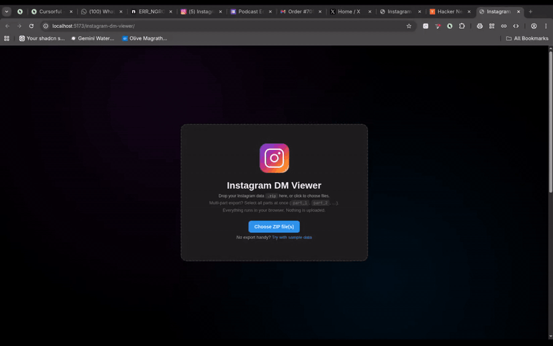

# Instagram DM Viewer

**[→ Try the live demo](https://devfaraaz.github.io/instagram-dm-viewer/)** · No install, no signup, no upload. Drop in your Instagram data `.zip` and the file never leaves your browser.

<p align="center">
  <a href="https://devfaraaz.github.io/instagram-dm-viewer/">
    
  </a>
</p>

A 100% client-side viewer for your Instagram data export. Browse your DMs in an Instagram-style chat UI. Nothing is uploaded — everything runs locally.

Supports both export formats Instagram offers (**JSON** and **HTML**), multi-part exports (`part_1`, `part_2`, …), photos / videos / voice messages, reactions, and per-thread search.

[](https://github.com/DevFaraaz/instagram-dm-viewer/stargazers) [](./LICENSE) [](https://vitejs.dev/)

## Why

Instagram lets you download your data, but the result is a folder of raw JSON or HTML files that's painful to read. This tool gives you the chat UI Instagram itself doesn't ship.

## Features

- **Drop-and-go** — select all parts of your export at once; everything stays local
- **Streaming ZIP read** — uses [fflate](https://github.com/101arrowz/fflate) with a worker so the UI stays responsive on multi-GB exports
- **Variable-height virtual list** — only the visible messages render, so 100k+ message threads scroll smoothly
- **Both formats** — automatically detects whether each thread is JSON or HTML and parses accordingly
- **Lazy media** — photos / videos / audio are decoded on demand from the in-memory ZIP and freed when you leave a thread
- **Per-thread search** with match navigation and highlight
- **Conversation sidebar** sorted by most recent activity, with title / participant / preview filtering
- **Instagram-style dark theme** — left-gray / right-blue bubbles, date separators, sticky header, lightbox on photo click
- **UTF-8 mojibake fix** — undoes the Latin-1-encoded UTF-8 mangling that IG ships in its JSON exports

## Quick start

```bash
npm install
npm run dev      # localhost:5173
```

Then drop your Instagram export `.zip` (or all parts of a multi-part export) onto the page.

To build:
```bash
npm run build
npm run preview
```

## How to get your Instagram export

1. Instagram → **Accounts Center** → **Your information and permissions** → **Download your information**
2. Pick **JSON** or **HTML** (this viewer supports either; JSON tends to be a bit smaller)
3. Wait 1–2 days for Instagram to email you the download link
4. Download all parts (very large exports get split into multiple `.zip`s)

## Architecture

```
src/
├── main.js              # entry: drag-and-drop, progress UI, screen routing
├── zipManager.js        # streams ZIP → Map<path, Uint8Array> via fflate's AsyncUnzipInflate
├── conversationList.js  # scans messages/inbox/*; cheap byte-level extraction for sidebar metadata
├── chatViewer.js        # parses selected thread, renders bubbles, in-thread search
├── htmlParser.js        # IG HTML format → normalized message records
├── virtualList.js       # binary-search offsets + measured-height cache
├── mediaLoader.js       # blob-URL cache, basename fallback resolver
├── utils.js             # encoding fix, time/date formatting, mime sniffing
└── styles.css
```

### Performance notes

- ZIP reading uses fflate's streaming `Unzip` so the original buffer never has to live fully in memory.
- Decompression runs in a worker (`AsyncUnzipInflate`) so the UI stays interactive while the bytes flow through.
- Indexing decodes only the **first 256 KB** of each thread file. Title / participants / first message all live near the top, so per-conversation indexing is constant-time regardless of thread size.
- Full thread parsing happens lazily, only when a conversation is opened.
- The virtual list re-measures heights on render and adjusts scrollTop so growing items above the viewport don't cause visible jumps.

### Memory caveat

Decompressed ZIP bytes are held in the JS heap as `Uint8Array`s. On desktop Chrome with ≥16 GB RAM this is fine for exports up to ~5 GB. Mobile browsers (1–2 GB heap caps) and very large exports (10+ GB) will hit memory limits. If you need that, the right next step is moving media to on-demand reads from the source `File` via `Blob.slice` + per-entry inflate, which keeps resident memory in the tens of MB regardless of export size.

## Privacy

Everything runs locally. The page makes **no network requests** with your data. You can verify by loading it offline or checking the Network tab in DevTools.

## License

MIT — see [LICENSE](./LICENSE).
